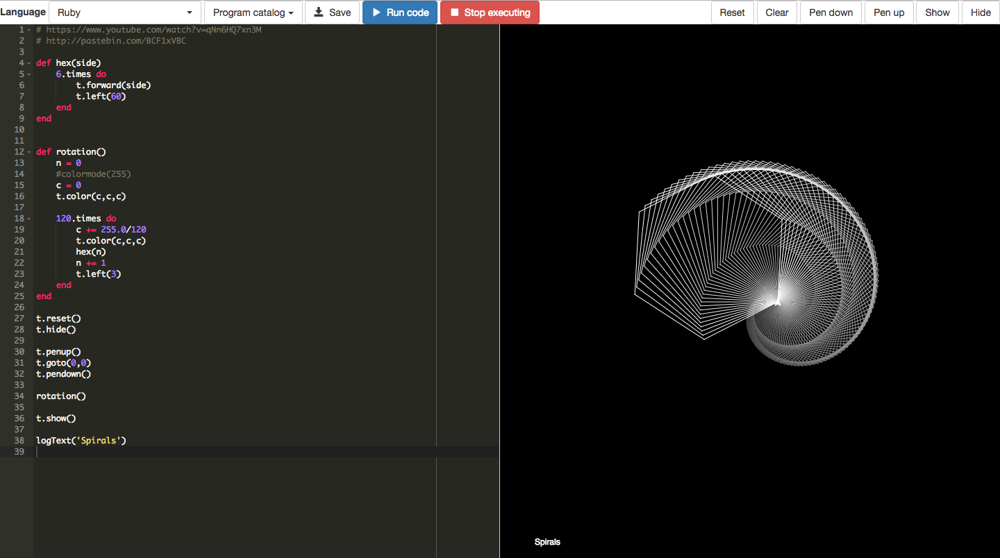

# Turtle programming sandbox

## Setup and usage

Install dependencies:

```
npm install
```

Run server:

```
gulp dev
```

This starts a server on port 8080. The following URL parameters are supported:

- `program`: Loads a program stored in `./sketches`
- `language`: Any of the supported languages
- `autorun`: Autoruns the program

http://localhost:8080/?program=clones&language=ruby

## Screenshots





## Supported languages
- JavaScipt (native, best support)
- CoffeeScript (almost native, next-best support)
- Ruby (good support)
- Python (decent support)

## Libraries versions
- [p5.js](https://p5js.org/) 0.5.7
- [CoffeeScript](http://coffeescript.org/) compiler v1.12.4
- [Opal](http://opalrb.org/) 0.10.1
- [Skulpt](http://www.skulpt.org/)
- [Please JS](http://www.checkman.io/please/)

## Known caveats and bugs
- When using Ruby, globals are not retained
- After upgrading to p5.js 0.5.7, holding the key down does not trigger repeated calls of keyTyped()

## To Program
- bulid reference side bar
- build module side bar
- bootstrap for prettify layout
- React(?) future future

## To Address
-Multiple languages. python (count lines for limits on goals)
-Goals:
  Conditionals
  Loops (simple AI maze follower)
  
  String processing - hangman
  
  Games: for future after trivial tasks.
  Cheatsheet for syntax
  
Other things: string processing, recursion
As modules, continue lower amount of code provided.
Open notes, harder from that.

Module 1:
Turtle programming.
Do basic tasks, draw things, get sense for dot operation, and functions, arithmetic, or things.

Module 2:
Conditionals: Age program
Loops: simple AI Maze follower
Arrays:
Function writing:

Module 3:
Days of the week problem. n days after dd/mm/year what day of week?
Is this year a leap year?
Basic logic
Draw basic competition problems.

Module 4:
Classes!
Good software engineering practices, no repeat code, good pseudocode.
Extend turtle, and make space ship.

Module 5:
Tic-tac-toe

Module 6:
-Dodging crap from sky game

Module 7:
-Tank Game


  
## Resources
http://codetheory.in/creating-the-environment-to-write-code-and-render-in-realtime/
https://forresto.github.io/turtle-svg/
http://berniepope.id.au/html/js-turtle/turtle.html (sketch.js inspired by this)
https://ycatch.github.io/p5.turtle.js/
Python turtle: https://docs.python.org/2/library/turtle.html
https://michael0x2a.com/blog/turtle-examples
https://github.com/peterc/trtl/tree/master/examples
http://leahbuechley.com/Turtle/index.html

TurtleScript?  https://github.com/cscott/TurtleScript

Cycloids?
http://www.di.unito.it/~barbara/MicRobot/AttiEuroLogo2007/proceedings/W-Foltynowicz.pdf

[Ramda two-pane editor](http://ramdajs.com/repl)

[Bootstrap + Ace editor](http://www.bootply.com/hYVxKShFtM)
